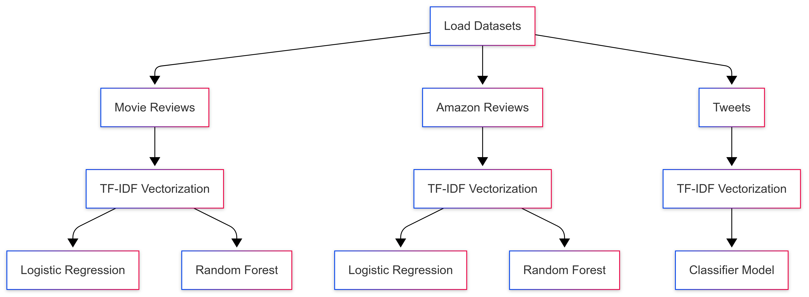

# Sentiment Analysis NLP project
- In this project we make binary and multi-class sentiment analysis.
- The reviews are in many languages, so we have to detect first which language is used then decide wherever review is positive or negative.
- The training dataset is ```imdb_reviews.csv``` movie reviews. But it is only available for binary sentiment analysis. We have to make multi-class analysis.



## Prerequisites
1. Make sure to have python installed.
2. Clone this repository.
3. Create a ```.venv```. It would be perfect to configurate your IDE to compiler to you ```.venv```.
4. Activate your ```.venv```
5. Install ```jupyter notebooks```.
6. Enjoy coding!
